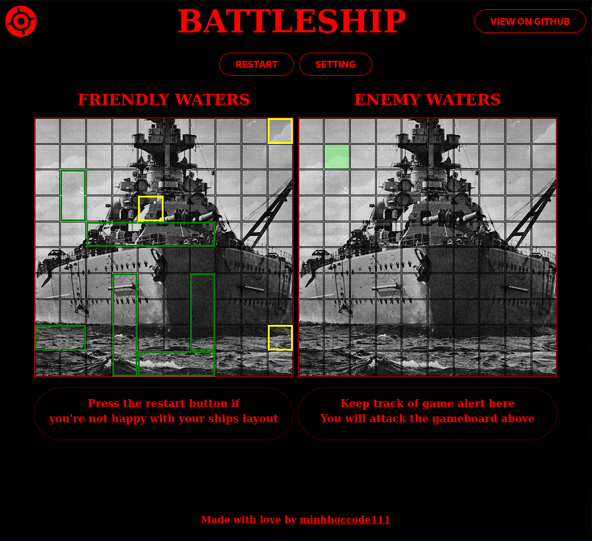

# Project Battleship

The **Battleship** project is created according to the assignment from **The Odin Project** [lesson](https://www.theodinproject.com/lessons/node-path-javascript-battleship)
<br>
<br>



## **Live preview** of the project is [here](https://minhhoccode111.github.io/battleship-top/)

## **Features**

- "Smart" BOT moves without cheating
- Can choose gameboard size
- Can choose number of ships and its length
- Can choose mode

## **Outcome**

- Used Webpack
- Used NPM
- Used Jest
- Learned Test Driven Development

## **Getting Started**

HTTP

```bash
git clone https://github.com/minhhoccode111/battleship-top.git
```

Git

```bash
git clone git@github.com:minhhoccode111/battleship-top.git
```

Start

```bash
cd battleship-top

npm install

npm start
```

## **Idea(s) to implement**

- Animations
- Multi players

## **Navigation**

- See my previous project [Weather App](https://github.com/minhhoccode111/weather-app-top)
- See my next project [Personal portfolio](https://github.com/minhhoccode111/personal-portfolio)
- See all my projects' live demos [This link](https://github.com/minhhoccode111)
